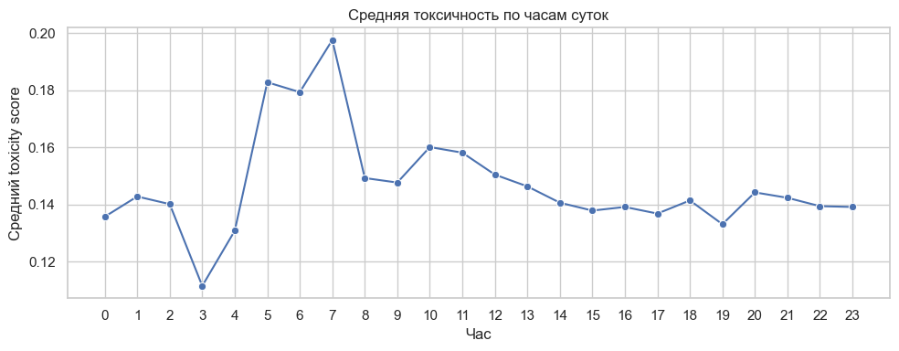
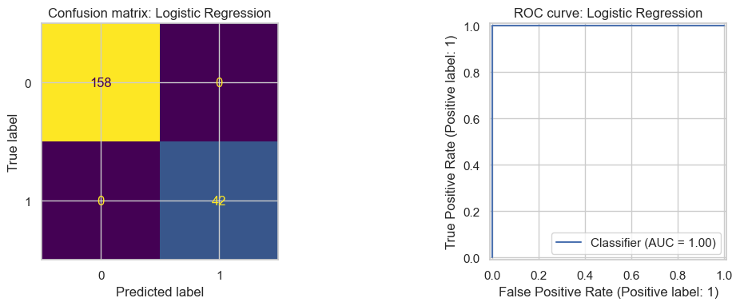
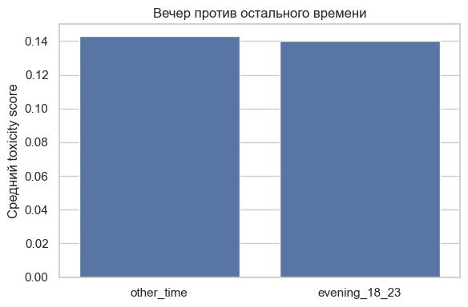
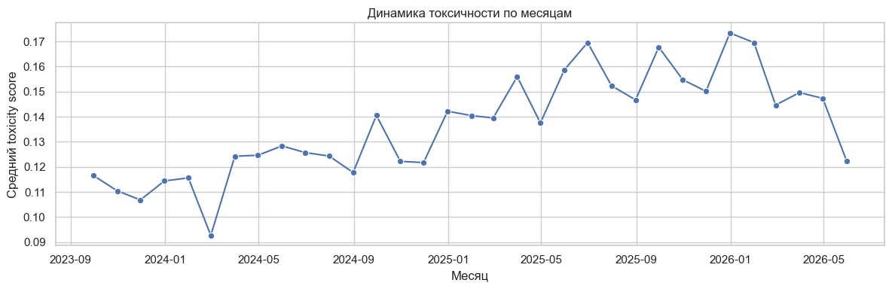
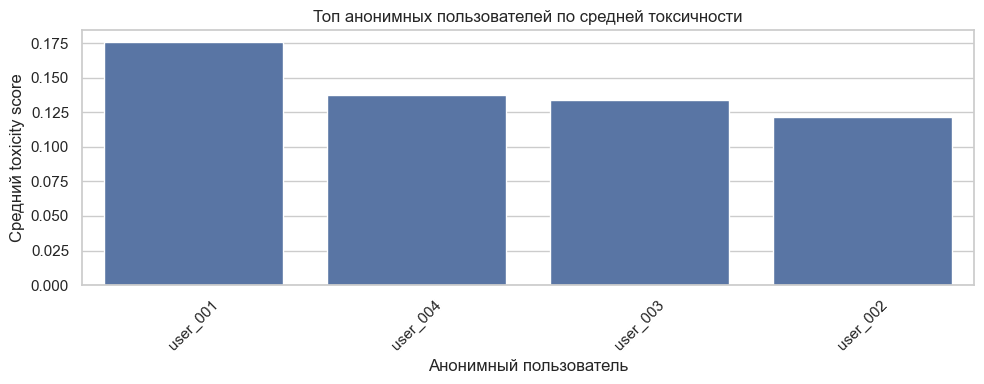

# Toxicity Chat Analysis

Проект по машинному обучению для анализа токсичности в Telegram-переписке.  
Цель - подготовить анонимизированный датасет сообщений, разметить токсичность и обучить бинарные модели, которые оценивают вероятность токсичного сообщения.

## Что внутри

| Путь | Назначение |
| --- | --- |
| `toxicity_chat_analysis.ipynb` | Главный ноутбук с полным анализом, обучением моделей, метриками и графиками |
| `xgb.ipynb` | Отдельный эксперимент с XGBoost на выборке из 10000 сообщений |
| `data/labeling_sample.csv` | Анонимизированная выборка из 10000 сообщений для ручной разметки |
| `data/labeled_messages.csv` | Размеченная выборка с колонкой `toxic` |
| `scripts/prepare_labeling_sample.py` | Подготовка и анонимизация сообщений из Telegram JSON |
| `scripts/auto_label_sample.py` | Создание слабой разметки по эвристикам |
| `scripts/build_notebook.py` | Генерация ноутбука |
| `requirements.txt` | Python-зависимости |

Сырые экспорты Telegram (`kpp.json`, `ls.json`)

## Дизайн-документ

Этот раздел фиксирует основные решения проекта: что именно решается, какие данные используются, почему выбраны такие признаки и модели, как измеряется качество и какие ограничения остаются.

### Артефакты по этапам работы с данными

| Этап | Артефакт | Что фиксируется |
| --- | --- | --- |
| Сбор и чтение данных | `kpp.json`, `ls.json`, `scripts/prepare_labeling_sample.py` | Источники Telegram-экспорта, фильтрация служебных и пустых сообщений |
| Анонимизация | `scripts/prepare_labeling_sample.py`, `data/labeling_sample.csv` | Замена пользователей на `user_001`, маскирование ссылок, email, телефонов и упоминаний |
| Формирование выборки | `data/labeling_sample.csv`, `data/dataset_summary.json` | Выборка из `10000` сообщений, баланс между случайными сообщениями и risk-кандидатами |
| Разметка | `data/labeled_messages.csv`, `scripts/auto_label_sample.py` | Ручная колонка `toxic` или слабая авторазметка по словарям и `risk_score` |
| Признаки | `toxicity_chat_analysis.ipynb`, `xgb.ipynb` | TF-IDF по тексту и числовые признаки сообщения |
| Обучение моделей | `toxicity_chat_analysis.ipynb`, `xgb.ipynb` | Baseline-модели, XGBoost, разбиение train/test и кросс-валидация |
| Оценка качества | `toxicity_chat_analysis.ipynb`, `xgb.ipynb`, `assets/*.png` | Метрики, confusion matrix, ROC/PR-кривые, learning curves, графики динамики |

### Цель и метрики

Цель проекта - построить модель, которая по тексту и простым статистическим признакам сообщения определяет, является ли сообщение токсичным.

Целевая переменная:

- `toxic = 1` - токсичное сообщение: оскорбление, агрессия, унижение, угроза или токсичный мат;
- `toxic = 0` - нейтральное сообщение или эмоциональная речь без атаки на человека или группу.

Основная метрика качества - `F1`, потому что классы несбалансированы: токсичных сообщений меньше, чем нейтральных. `Accuracy` в такой задаче может быть обманчивой: модель может часто отвечать `0` и получать высокий accuracy, но плохо находить токсичные сообщения.

Дополнительные метрики:

- `precision` - насколько точны срабатывания модели по классу `toxic = 1`;
- `recall` - какую долю токсичных сообщений модель нашла;
- `ROC-AUC` - насколько хорошо модель ранжирует сообщения по вероятности токсичности;
- `Average Precision` - качество ранжирования для положительного класса при дисбалансе;
- confusion matrix - разбор ошибок по типам: false positive и false negative.

### Данные

Источники данных - Telegram-экспорты `kpp.json` и `ls.json`.

Текущая статистика подготовки:

- исходных сообщений: `415311`;
- сообщений после фильтрации: `381812`;
- анонимизированных пользователей: `4`;
- размер выборки для разметки: `10000`.

Основные поля итоговой таблицы:

- `text` - очищенный и анонимизированный текст сообщения;
- `chat` - источник сообщения;
- `user` - анонимный пользователь;
- `date`, `hour`, `month` - временные признаки;
- `risk_score` - эвристический риск токсичности;
- `char_len`, `word_count` - длина сообщения;
- `profanity_count`, `hostile_count` - количество найденных слов из словарей;
- `exclamation_count`, `question_count`, `caps_ratio` - дополнительные признаки эмоциональности;
- `toxic` - целевая метка.

Ограничения данных:

- данные приватные, поэтому реальные имена и контакты удаляются;
- часть разметки может быть слабой авторазметкой, а не ручной экспертной оценкой;
- переписка взята из ограниченного набора чатов, поэтому выводы нельзя автоматически переносить на все Telegram-чаты;
- токсичность зависит от контекста, а отдельное сообщение не всегда содержит весь контекст диалога.

### Подход

В проекте используются два уровня экспериментов.

Первый уровень - основной ноутбук `toxicity_chat_analysis.ipynb`:

- готовит и анализирует данные;
- формирует признаки;
- обучает baseline-модели: Logistic Regression, Linear SVM, RandomForest;
- сравнивает модели по `F1` и `ROC-AUC`;
- применяет лучшую модель ко всем сообщениям;
- строит графики токсичности по часам, месяцам и пользователям.

Второй уровень - отдельный эксперимент `xgb.ipynb`:

- берёт `data/labeling_sample.csv` на `10000` строк;
- если ручная колонка `toxic` ещё не заполнена, создаёт weak labels по правилам;
- строит pipeline `TF-IDF + numeric features + XGBoost`;
- подбирает объём обучающих данных;
- подбирает гиперпараметры через `RandomizedSearchCV`;
- обучает финальную модель на полном train;
- считает метрики на holdout test;
- строит learning curves, ROC/PR-кривые, confusion matrix и важность признаков.

Признаки:

- текстовые признаки строятся через `TfidfVectorizer`;
- числовые признаки добавляются через `ColumnTransformer`;
- для XGBoost используется `scale_pos_weight`, чтобы учесть дисбаланс классов.

Валидация:

- train/test split со стратификацией;
- подбор параметров только на train-части;
- финальная оценка на отложенном test;
- learning curves для проверки переобучения и зависимости качества от размера обучающей выборки.

### Риски

Главные риски и ограничения:

- Слабая разметка может завышать качество. Если `toxic` создан эвристиками, модель может научиться воспроизводить эти же правила, а не настоящую человеческую оценку токсичности.
- Возможна утечка признаков. Например, `risk_score`, `profanity_count` и `hostile_count` участвуют и в авторазметке, и в обучении. Поэтому результаты на weak labels нужно трактовать как baseline, а не как финальную оценку.
- Контекст сообщения теряется. Некоторые токсичные высказывания понятны только из предыдущих сообщений, а модель классифицирует отдельные строки.
- Данные ограничены несколькими чатами и несколькими анонимными пользователями, поэтому модель может хуже переноситься на другие сообщества.

### Анализ ошибок

Для анализа ошибок в проекте используются:

- confusion matrix - показывает false positive и false negative;
- classification report - отдельно показывает precision, recall и F1 по классам;
- ROC-кривая - показывает качество ранжирования при разных порогах;
- Precision-Recall кривая - полезна при дисбалансе классов;
- подбор threshold - помогает выбрать баланс между precision и recall;
- learning curves - показывают, переобучается ли модель и помогает ли увеличение данных;
- feature importance в `xgb.ipynb` - показывает, какие слова и числовые признаки сильнее всего влияют на решения XGBoost.

Калибровка модели в текущей версии явно не выделена в отдельный этап для XGBoost, но вероятность `predict_proba` анализируется через ROC/PR-кривые и подбор порога. Для более строгой калибровки можно добавить `CalibratedClassifierCV` или построить calibration curve и сравнить вероятности модели с фактической долей токсичных сообщений в бинах.

Остатки и ошибки стоит разбирать вручную по двум группам:

- false positive - нейтральные сообщения, ошибочно отмеченные как токсичные;
- false negative - токсичные сообщения, которые модель пропустила.

Особенно важно проверять ошибки на ручной разметке, потому что на авторазметке модель может выглядеть слишком хорошо.

## Основной результат

Главный артефакт проекта:

```bash
toxicity_chat_analysis.ipynb
```

В ноутбуке реализованы:

- загрузка Telegram JSON;
- нормализация текстов из разных форматов экспорта;
- анонимизация пользователей, ссылок, email, телефонов и упоминаний;
- подготовка признаков сообщения;
- формирование выборки для разметки;
- обучение Logistic Regression, Linear SVM и RandomForest;
- сравнение моделей по F1 и ROC-AUC;
- скоринг всех сообщений;
- графики динамики токсичности по часам и месяцам.

## Быстрый запуск

Создать виртуальное окружение и установить зависимости:

```bash
python3 -m venv .venv
.venv/bin/pip install -r requirements.txt
```

Открыть ноутбук:

```bash
.venv/bin/jupyter notebook toxicity_chat_analysis.ipynb
```

## Подготовка данных

Если рядом с проектом лежат Telegram-экспорты `kpp.json` и `ls.json`, можно пересобрать выборку для разметки:

```bash
.venv/bin/python scripts/prepare_labeling_sample.py
```

По умолчанию скрипт:

- читает `kpp.json` и `ls.json`;
- оставляет только обычные текстовые сообщения;
- заменяет реальные идентификаторы пользователей на `user_001`, `user_002` и т.д.;
- сохраняет выборку в `data/labeling_sample.csv`;
- сохраняет краткую статистику в `data/dataset_summary.json`.

Можно указать размер выборки:

```bash
.venv/bin/python scripts/prepare_labeling_sample.py --sample-size 10000
```

## Разметка

В файле `data/labeling_sample.csv` нужно заполнить колонку `toxic`:

- `1` - оскорбление, унижение, агрессия, угроза или токсичный мат в адрес человека/группы;
- `0` - нейтральное сообщение, обычная эмоциональная речь или мат без атаки на человека.

После ручной разметки файл можно сохранить как:

```bash
data/labeled_messages.csv
```

Если ручной разметки нет, можно создать слабые метки автоматически:

```bash
.venv/bin/python scripts/auto_label_sample.py
```

Авторазметка использует простые правила: словарь мата/оскорблений и повышенный `risk_score`. Для учебного прототипа этого достаточно, но для финального отчета стоит явно указать, что использовалась эвристическая разметка.

## Признаки

Для каждого сообщения считаются:

- длина текста;
- количество слов;
- количество найденных обсценных слов;
- количество враждебных слов;
- число `!` и `?`;
- доля заглавных букв;
- общий `risk_score`.

Текстовые признаки строятся через TF-IDF, а числовые признаки добавляются к ним перед обучением моделей.

## Графики и интерпретация

Ноутбук строит несколько графиков, которые помогают не только проверить качество модели, но и понять динамику токсичности в переписке.

### Средняя токсичность по часам суток

Линейный график показывает средний `toxicity score` для каждого часа от `0` до `23`.



По текущему результату видно:

- минимальная токсичность наблюдается около `03:00`;
- самый заметный пик приходится примерно на `07:00`;
- после утреннего пика значения становятся ровнее и держатся примерно в диапазоне `0.13-0.16`;
- вечером нет резкого роста токсичности, значения близки к среднему уровню.

Этот график нужен, чтобы проверить гипотезу о связи токсичности со временем суток.

### Confusion matrix и ROC-кривая

Для лучшей модели, Logistic Regression, ноутбук строит confusion matrix и ROC-кривую.



Текущая confusion matrix:

- `158` нейтральных сообщений классифицированы как нейтральные;
- `42` токсичных сообщения классифицированы как токсичные;
- ложных срабатываний нет;
- пропущенных токсичных сообщений нет.

ROC-кривая показывает `AUC = 1.00`, то есть на тестовой выборке модель идеально разделила два класса.

Такой результат нужно трактовать осторожно: если разметка была создана эвристиками, модель могла хорошо выучить те же признаки, по которым создавались метки. Для финального вывода лучше отдельно указать, была ли разметка ручной или автоматической.

### Вечер против остального времени

Столбчатый график сравнивает среднюю токсичность вечером (`18:00-23:00`) и в остальное время.



По текущему графику:

- средняя токсичность вечером почти не отличается от остального времени;
- значения находятся примерно на одном уровне: около `0.14`;
- гипотеза о выраженном вечернем росте токсичности не подтверждается.

Этот график удобен как простая проверка конкретной исследовательской гипотезы.

### Динамика токсичности по месяцам

Линейный график показывает, как средний `toxicity score` менялся по месяцам.



По текущей динамике видно:

- в конце `2023` и начале `2024` токсичность была ниже;
- в течение `2024-2025` средний уровень постепенно растет;
- локальные пики появляются во второй половине `2025` и в начале `2026`;
- к последним месяцам на графике значение снижается.

Этот график показывает не отдельные всплески сообщений, а общий месячный тренд.

### Топ анонимных пользователей по средней токсичности

Столбчатый график сравнивает анонимных пользователей по среднему `toxicity score`.



По текущему результату:

- самый высокий средний score у `user_001`;
- `user_004` и `user_003` находятся близко друг к другу;
- самый низкий средний score среди показанных пользователей у `user_002`;
- пользователи остаются анонимными, поэтому график подходит для отчета без раскрытия личности участников.

Важно: средняя токсичность пользователя зависит от количества сообщений. Если сообщений у пользователя мало, его средний score может быть менее надежным.

## Данные

Текущая подготовленная статистика:

- исходных сообщений: `415311`;
- сообщений после фильтрации: `381812`;
- анонимизированных пользователей: `4`;
- размер выборки для разметки: `10000`.

## Приватность

Проект специально не хранит реальные имена участников в обучающих CSV:

- `from_id` заменяется на стабильные анонимные значения вида `user_001`;
- ссылки заменяются на `<URL>`;
- email заменяются на `<EMAIL>`;
- телефоны заменяются на `<PHONE>`;
- Telegram-упоминания заменяются на `<MENTION>`.

В отчет не стоит вставлять реальные тексты переписки. Лучше использовать агрегированные метрики, графики и обезличенные примеры.

## Структура проекта

```text
.
├── data/
│   ├── labeling_sample.csv
│   └── labeled_messages.csv
├── assets/
│   ├── evening_vs_other_time.png
│   ├── logistic_regression_confusion_roc.png
│   ├── toxicity_by_hour.png
│   ├── toxicity_by_month.png
│   └── top_users_by_toxicity.png
├── scripts/
│   ├── auto_label_sample.py
│   ├── build_notebook.py
│   └── prepare_labeling_sample.py
├── toxicity_chat_analysis.ipynb
├── xgb.ipynb
├── requirements.txt
├── README.md
└── LICENSE
```

## Лицензия

Проект распространяется по лицензии Apache License 2.0. См. файл `LICENSE`.
